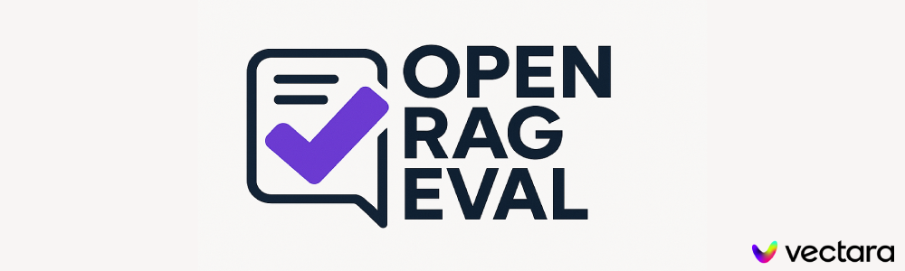
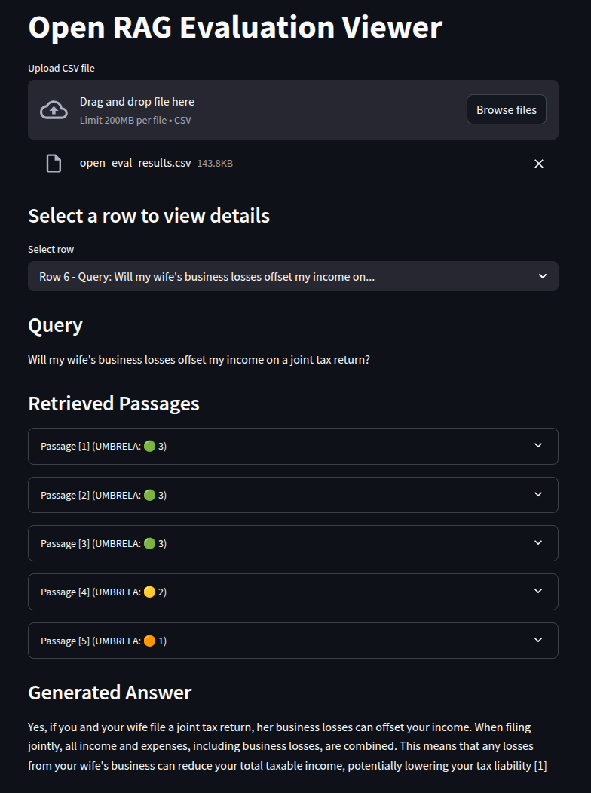
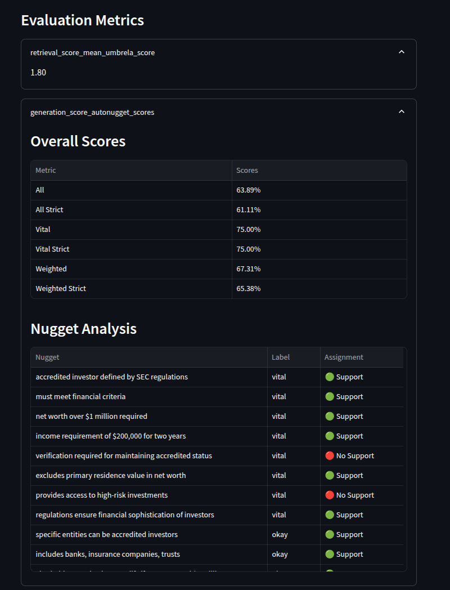

# Open-RAG-Eval
<p align="center">
  
</p>

[](https://opensource.org/licenses/Apache-2.0)

[](https://twitter.com/vectara)
[](https://discord.com/invite/GFb8gMz6UH)

[](https://vscode.dev/redirect?url=vscode://ms-vscode-remote.remote-containers/cloneInVolume?url=https://github.com/vectara/open-rag-eval)

**Evaluate and improve your Retrieval-Augmented Generation (RAG) pipelines with `open-rag-eval`, an open-source Python evaluation toolkit.**

Evaluating RAG quality can be complex. `open-rag-eval` provides a flexible and extensible framework to measure the performance of your RAG system, helping you identify areas for improvement. Its modular design allows easy integration of custom metrics and connectors for various RAG implementations.

Out-of-the-box, the toolkit includes:
* An implementation of the evaluation metrics used in the **TREC-RAG benchmark**.
* A connector for the **Vectara RAG platform**.

# Key Features

* **Standard Metrics:** Provides TREC-RAG evaluation metrics ready to use.
* **Modular Architecture:** Easily add custom evaluation metrics or integrate with any RAG pipeline.
* **Detailed Reporting:** Generates per-query scores and intermediate outputs for debugging and analysis.
* **Visualization:** Compare results across different configurations or runs with plotting utilities.

# Getting Started Guide

This guide walks you through an end-to-end evaluation using the toolkit. We'll use Vectara as the example RAG platform and the TRECRAG evaluator.

## Prerequisites

* **Python:** Version 3.9 or higher.
* **OpenAI API Key:** Required for the default LLM judge model used in some metrics. Set this as an environment variable: `export OPENAI_API_KEY='your-api-key'`
* **Vectara Account:** To enable the Vectara connector, you need:
    * A [Vectara account](https://console.vectara.com/signup).
    * A corpus containing your indexed data.
    * An [API key](https://docs.vectara.com/docs/api-keys) with querying permissions.
    * Your Customer ID and Corpus key.

## Installation

In order to build the library from source, which is the recommended method to follow the sample instructions below you can do:

```
$ git clone https://github.com/vectara/open-rag-eval.git
$ cd open-rag-eval
$ pip install -e .
```

If you want to install directly from pip, which is the common method if you want to use the library in your own pipeline instead of running the samples, you can run:

```
pip install open-rag-eval
```

After installing the library you can follow instructions below to run a sample evaluation and test out the library end to end. 

## Using Open-RAG-Eval with the Vectara connector

### Step 1. Configure Evaluation Settings

Edit the [eval_config.yaml](https://github.com/vectara/open-rag-eval/blob/main/eval_config.yaml) file. This file controls the evaluation process, including connector details, evaluator choices, and metric settings. Update the `connector` section with your Vectara `customer_id` and `corpus_key`.

In addition, make sure you have `VECTARA_API_KEY` and `OPENAI_API_KEY` available in your environment. For example:
* export VECTARA_API_KEY='your-vectara-api-key'
* export OPENAI_API_KEY='your-openai-api-key'

### Step 2. Prepare RAG Output

You need the results (answers and retrieved contexts) from your RAG system for the queries you want to evaluate.

open-rag-eval will automatically query your Vectara corpus and retrieve the results, as defined in your `eval_config.yaml` file.

### Step 3. Define Queries for Evaluation

Create a CSV file named `queries.csv` in the root directory. It should contain a single column named `query`, with each row representing a query you want to test against your RAG system.

Example `queries.csv`:

```csv
query
What is a blackhole?
How big is the sun?
How many moons does jupiter have?
```

### Step 4. Run evaluation!

With everything configured, now is the time to run evaluation! Run the following command from the root folder of open-rag-eval:

```bash
python open_rag_eval/run_eval.py --config eval_config.yaml
```

and you should see the evaluation progress on your command line. Once it's done, detailed results will be saved to a local CSV file where you can see the score assigned to each sample along with intermediate output useful for debugging and explainability.

### Step 5. Visualize results

You can use the `plot_results.py` script to plot results from your eval runs. Multiple different runs can be plotted on the same plot allowing for easy comparison of different configurations or RAG providers:

To plot one result:

```bash
python open_rag_eval/plot_results.py open_eval_results.csv
```

Or to plot multiple results:

```bash
python open_rag_eval/plot_results.py results_1.csv results_2.csv results_3.csv
```


## Using Open-RAG-Eval with your own RAG outputs
If you are using RAG outputs from your own pipeline, make sure to put your RAG output in a format that is readable by the toolkit (See `data/test_csv_connector.csv` as an example). 

### Step 1. Configure Evaluation Settings
Update the `eval_config.yaml` as follows:
* Comment out or delete the connector section
* uncomment input_results and point it to the CSV file where your RAG results are stored.

### Step 2. Run evaluation!

With everything configured, now is the time to run evaluation! Run the following command:

```bash
python open_rag_eval/run_eval.py --config eval_config.yaml
```

and you should see the evaluation progress on your command line. Once it's done, detailed results will be saved to a local CSV file where you can see the score assigned to each sample along with intermediate output useful for debugging and explainability.

### Step 3. Visualize results

You can use the `open_rag_eval/plot_results.py` script to plot results from your eval runs. Multiple different runs can be plotted on the same plot allowing for easy comparison of different configurations or RAG providers. For example if the output evaluation results from two runs are saved in `open_eval_results_1.csv` and `open_eval_results_2.csv` you can plot both of them as follows:

```bash
python open_rag_eval/plot_results.py open_eval_results_1.csv open_eval_results_2.csv 
```

### Step 4. Deep dive into results

The visualization in step 3. above shows you the aggregated metrics across one or more runs of the evaluation on several queries. If you want to deep dive into the results, we have a results viewer which enables easy viewing od the produced metrics CSV where you can look at the intermediate results and detailed breakdown of scores and metrics on a per query basis. To do this:

```bash
cd open_rag_eval/viz/
streamlit run visualize.py
```

Note that you will need to have streamlit installed in your environment (which should be the case if you've installed open-rag-eval). Once you upload your evaluation results CSV (`open_eval_results.csv` by default) you can select a query to view detailed metrics for such as the produced nuggets by the AutoNuggetizer, the UMBRELA scores assigned to each retrieved result and so on.

<p align="center">
  
  
</p>

# How does open-rag-eval work?

## Evaluation Workflow

The `open-rag-eval` framework follows these general steps during an evaluation:

1.  **(Optional) Data Retrieval:** If configured with a connector (like the Vectara connector), call the specified RAG provider with a set of input queries to generate answers and retrieve relevant document passages/contexts. If using pre-existing results (`input_results`), load them from the specified file.
2.  **Evaluation:** Use a configured **Evaluator** to assess the quality of the RAG results (query, answer, contexts). The Evaluator applies one or more **Metrics**.
3.  **Scoring:** Metrics calculate scores based on different quality dimensions (e.g., faithfulness, relevance, context utilization). Some metrics may employ judge **Models** (like LLMs) for their assessment.
4.  **Reporting:** Generate a detailed report (typically CSV) containing the scores for each query, along with intermediate data useful for analysis and debugging.

## Core Abstractions

* **Metrics:** Metrics are the core of the evaluation. They are used to measure the quality of the RAG system, each metric has a different focus and is used to evaluate different aspects of the RAG system. Metrics can be used to evaluate the quality of the retrieval, the quality of the (augmented) generation, the quality of the RAG system as a whole.
* **Models:** Models are the underlying judgement models used by some of the metrics. They are used to judge the quality of the RAG system. Models can be diverse: they may be LLMs, classifiers, rule based systems, etc.
* **Evaluators:** Evaluators can chain together a series of metrics to evaluate the quality of the RAG system. 
* **RAGResults:** Data class representing the output of a RAG pipeline for a single query (input query, generated answer, retrieved contexts/documents). This is the primary input for evaluation.
* **ScoredRAGResult:** Data class holding the original `RAGResults` plus the scores assigned by the `Evaluator` and its `Metrics`. These are typically collected and saved to the output report file.

# Web API

For programmatic integration, the framework provides a Flask-based web server.

**Endpoints:**
* `/api/v1/evaluate`: Evaluate a single RAG output provided in the request body.
* `/api/v1/evaluate_batch`: Evaluate multiple RAG outputs in a single request.

**Run the Server:**
```bash
python open_rag_eval/run_server.py
```

See the [API README](/api/README.md) for detailed documentation for the API.

## Author

👤 **Vectara**

- Website: [vectara.com](https://vectara.com)
- Twitter: [@vectara](https://twitter.com/vectara)
- GitHub: [@vectara](https://github.com/vectara)
- LinkedIn: [@vectara](https://www.linkedin.com/company/vectara/)
- Discord: [@vectara](https://discord.gg/GFb8gMz6UH)

## 🤝 Contributing

Contributions, issues and feature requests are welcome and appreciated!<br />

Feel free to check [issues page](https://github.com/vectara/open-rag-eval/issues). You can also take a look at the [contributing guide](https://github.com/vectara/open-rag-eval/blob/master/CONTRIBUTING.md).

## Show your support

Give a ⭐️ if this project helped you!

## 📝 License

Copyright © 2025 [Vectara](https://github.com/vectara).<br />
This project is [Apache 2.0](https://github.com/vectara/open-rag-eval/blob/master/LICENSE) licensed.