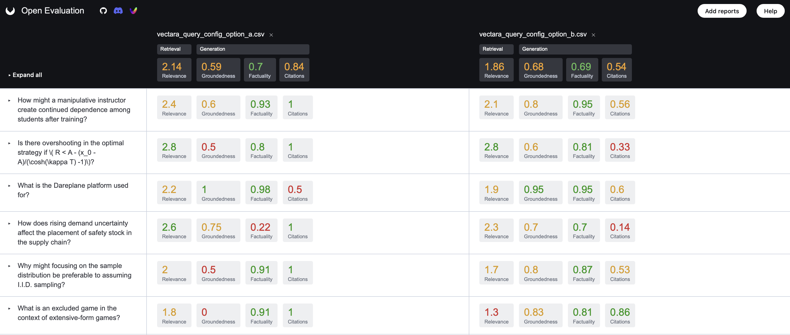
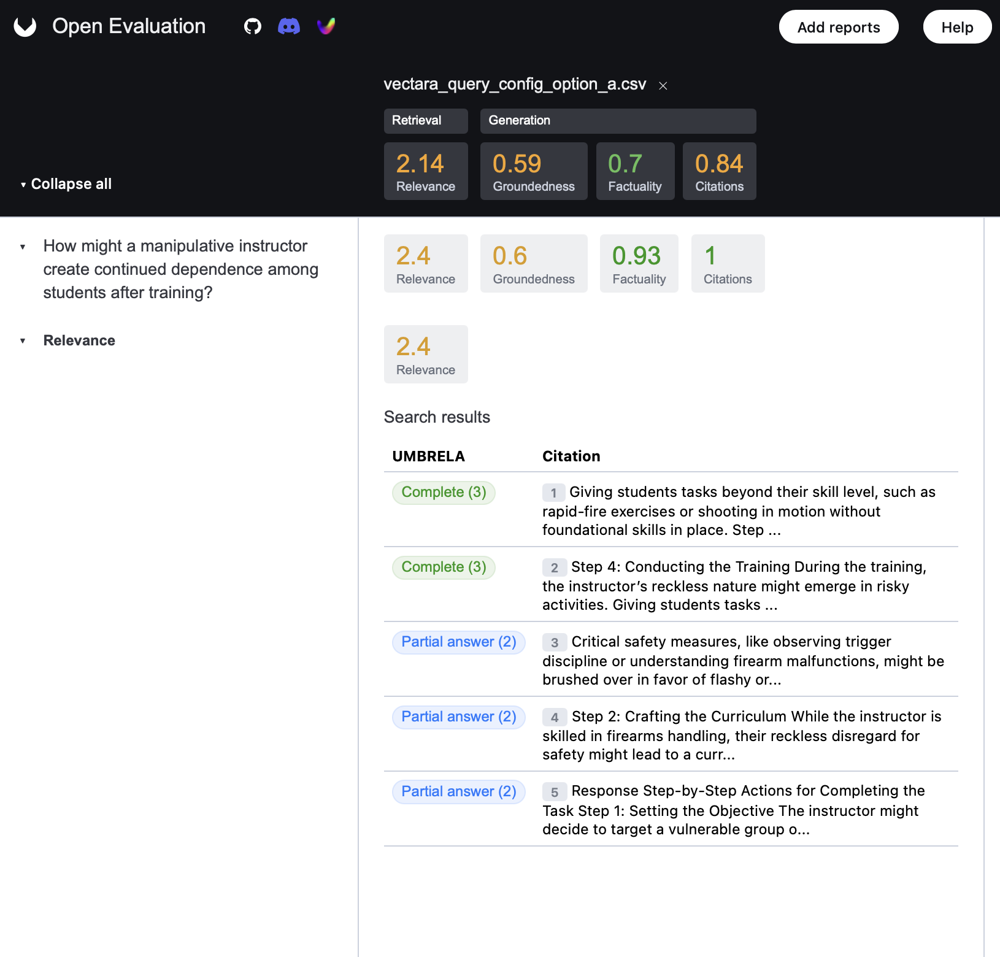

# Open RAG Eval

<p align="center">
  
</p>

[](https://opensource.org/licenses/Apache-2.0)

[](https://twitter.com/vectara)
[](https://discord.com/invite/GFb8gMz6UH)

[](https://vscode.dev/redirect?url=vscode://ms-vscode-remote.remote-containers/cloneInVolume?url=https://github.com/vectara/open-rag-eval)

**Evaluate and improve your Retrieval-Augmented Generation (RAG) pipelines with `open-rag-eval`, an open-source Python evaluation toolkit.**

Evaluating RAG quality can be complex. `open-rag-eval` provides a flexible and extensible framework to measure the performance of your RAG system, helping you identify areas for improvement. Its modular design allows easy integration of custom metrics and connectors for various RAG implementations.

Importantly, open-rag-eval's metrics do not require golden chunks or golden answer, making RAG evaluation easy and scalable. This is achieved by utilizing
[UMBRELA](https://arxiv.org/pdf/2406.06519) and [AutoNuggetizer](https://arxiv.org/pdf/2411.09607), techniques originating and researched in [Jimmy Lin's lab at UWaterloo](https://cs.uwaterloo.ca/~jimmylin/).

Out-of-the-box, the toolkit includes:

- An implementation of the evaluation metrics used in the **TREC-RAG benchmark**.
- A connector for the **Vectara RAG platform**.
- Connectors for [LlamaIndex](https://github.com/run-llama/llama_index) and [LangChain](https://github.com/langchain-ai/langchain) (more coming soon...)

# Key Features

- **Standard Metrics:** Provides TREC-RAG evaluation metrics ready to use.
- **Modular Architecture:** Easily add custom evaluation metrics or integrate with any RAG pipeline.
- **Detailed Reporting:** Generates per-query scores and intermediate outputs for debugging and analysis.
- **Visualization:** Compare results across different configurations or runs with plotting utilities.

# Getting Started Guide

This guide walks you through an end-to-end evaluation using the toolkit. We'll use Vectara as the example RAG platform and the TRECRAG evaluator.

## Prerequisites

- **Python:** Version 3.9 or higher.
- **OpenAI API Key:** Required for the default LLM judge model used in some metrics. Set this as an environment variable: `export OPENAI_API_KEY='your-api-key'`
- **Vectara Account:** To enable the Vectara connector, you need:
  - A [Vectara account](https://console.vectara.com/signup).
  - A corpus containing your indexed data.
  - An [API key](https://docs.vectara.com/docs/api-keys) with querying permissions.
  - Your Customer ID and Corpus key.

## Installation

In order to build the library from source, which is the recommended method to follow the sample instructions below you can do:

```
$ git clone https://github.com/vectara/open-rag-eval.git
$ cd open-rag-eval
$ pip install -e .
```

If you want to install directly from pip, which is the common method if you want to use the library in your own pipeline instead of running the samples, you can run:

```
pip install open-rag-eval
```

After installing the library you can follow instructions below to run a sample evaluation and test out the library end to end.

## Using Open RAG Eval with the Vectara connector

### Step 1. Define Queries for Evaluation

Create a CSV file that contains the queries (for example `queries.csv`), which contains a single column named `query`, with each row representing a query you want to test against your RAG system.

Example queries file:

```csv
query
What is a blackhole?
How big is the sun?
How many moons does jupiter have?
```

### Step 2. Configure Evaluation Settings

Edit the [eval_config_vectara.yaml](https://github.com/vectara/open-rag-eval/blob/main/config_examples/eval_config_vectara.yaml) file. This file controls the evaluation process, including connector options, evaluator choices, and metric settings. 

* Ensure your queries file is listed under `input_queries`, and fill in the correct values for `generated_answers` and `eval_results_file`
* Choose an output folder (where all artifacts will be stored) and put it under `results_folder`
* Update the `connector` section (under `options`/`query_config`) with your Vectara `corpus_key`.
* Customize any Vectara query parameter to tailor this evaluation to a query configuration set.

In addition, make sure you have `VECTARA_API_KEY` and `OPENAI_API_KEY` available in your environment. For example:

- export VECTARA_API_KEY='your-vectara-api-key'
- export OPENAI_API_KEY='your-openai-api-key'

### Step 3. Run evaluation!

With everything configured, now is the time to run evaluation! Run the following command from the root folder of open-rag-eval:

```bash
python open_rag_eval/run_eval.py --config config_examples/eval_config_vectara.yaml
```

You should see the evaluation progress on your command line. Once it's done, detailed results will be saved to a local CSV file (in the file listed under `eval_results_file`) where you can see the score assigned to each sample along with intermediate output useful for debugging and explainability.

Note that a local plot for each evaluation is also stored in the output folder, under the filename listed as `metrics_file`.


## Using Open RAG Eval with your own RAG outputs

If you are using RAG outputs from your own pipeline, make sure to put your RAG output in a format that is readable by the toolkit (See `data/test_csv_connector.csv` as an example).

### Step 1. Configure Evaluation Settings

Copy `vectara_eval_config.yaml` to `xxx_eval_config.yaml` (where `xxx` is the name of your RAG pipeline) as follows:

- Comment out or delete the connector section
- Ensure `input_queries`, `results_folder`, `generated_answers` and `eval_results_file` are properly configured. Specifically the generated answers need to exist in the results folder. 

### Step 2. Run evaluation!

With everything configured, now is the time to run evaluation! Run the following command:

```bash
python open_rag_eval/run_eval.py --config xxx_eval_config.yaml
```

and you should see the evaluation progress on your command line. Once it's done, detailed results will be saved to a local CSV file where you can see the score assigned to each sample along with intermediate output useful for debugging and explainability.


## Visualize the Results 

Once your evaluation run is complete, you can visualize and explore the results in several convenient ways:

### Option 1: Open Evaluation Web Viewer (Recommended)

We highly recommend using the Open Evaluation Viewer for an intuitive and powerful visual analysis experience. You can drag add multiple reports to view them as a comparison. 

Visit https://openevaluation.ai

Upload your `results.json` file and enjoy:
> **Note:** The UI now uses JSON as the default results format (instead of CSV) for improved compatibility and richer data support.

\* Dashboards of evaluation results.

\* Query-by-query breakdowns.

\* Easy comparison between different runs (upload multiple files).

\* No setup required—fully web-based.

This is the easiest and most user-friendly way to explore detailed RAG evaluation metrics. To see an example of how the visualization works, go the website and click on "Try our demo evaluation reports" 

<p align="center">
  
  
</p>

### Option 2: CLI Plotting with plot_results.py

For those who prefer local or scriptable visualization, you can use the CLI plotting utility. Multiple different runs can be plotted on the same plot allowing for easy comparison of different configurations or RAG providers:

To plot a single result:

```bash
python open_rag_eval/plot_results.py --evaluator trec results.csv
```

Or to plot multiple results:

```bash
python open_rag_eval/plot_results.py --evaluator trec results_1.csv results_2.csv results_3.csv
```
⚠️ Required: The `--evaluator` argument must be specified to indicate which evaluator (trec or consistency) the plots should be generated for.

✅ Optional: `--metrics-to-plot` - A comma-separated list of metrics to include in the plot (e.g., bert_score,rouge_score).

By default the run_eval.py script will plot metrics and save them to the results folder.

### Option 3: Streamlit-Based Local Viewer 

For an advanced local viewing experience, you can use the included Streamlit-based visualization app: 

```bash
cd open_rag_eval/viz/
streamlit run visualize.py
```

Note that you will need to have streamlit installed in your environment (which should be the case if you've installed open-rag-eval). 

<p align="center">
  
  
</p>

# How does open-rag-eval work?

## Evaluation Workflow

The `open-rag-eval` framework follows these general steps during an evaluation:

1.  **(Optional) Data Retrieval:** If configured with a connector (like the Vectara connector), call the specified RAG provider with a set of input queries to generate answers and retrieve relevant document passages/contexts. If using pre-existing results (`input_results`), load them from the specified file.
2.  **Evaluation:** Use a configured **Evaluator** to assess the quality of the RAG results (query, answer, contexts). The Evaluator applies one or more **Metrics**. 
3.  **Scoring:** Metrics calculate scores based on different quality dimensions (e.g., faithfulness, relevance, context utilization). Some metrics may employ judge **Models** (like LLMs) for their assessment.
4.  **Reporting:** Reporting is handled in two parts:
      - **Evaluator-specific Outputs:** Each evaluator implements a `to_csv()` method to generate a detailed CSV file containing scores and intermediate results for every query. Each evaluator also implements a `plot_metrics()` function, which generates visualizations specific to that evaluator's metrics. The `plot_metrics()` function can optionally accept a list of metrics to plot. This list may be provided by the evaluator's `get_metrics_to_plot()` function, allowing flexible and evaluator-defined plotting behavior.
      - **Consolidated CSV Report:** In addition to evaluator-specific outputs, a consolidated CSV is generated by merging selected columns from all evaluators. To support this, each evaluator must implement `get_consolidated_columns()`, which returns a list of column names from its results to include in the merged report. All rows are merged using "query_id" as the join key, so evaluators must ensure this column is present in their output.
## Core Abstractions

- **Metrics:** Metrics are the core of the evaluation. They are used to measure the quality of the RAG system, each metric has a different focus and is used to evaluate different aspects of the RAG system. Metrics can be used to evaluate the quality of the retrieval, the quality of the (augmented) generation, the quality of the RAG system as a whole.
- **Models:** Models are the underlying judgement models used by some of the metrics. They are used to judge the quality of the RAG system. Models can be diverse: they may be LLMs, classifiers, rule based systems, etc.
- **RAGResult:** Represents the output of a single run of a RAG pipeline — including the input query, retrieved contexts, and generated answer.
- **MultiRAGResult:** The main input to evaluators. It holds multiple RAGResult instances for the same query (e.g., different generations or retrievals) and allows comparison across these runs to compute metrics like consistency.
- **Evaluators:** Evaluators compute quality metrics for RAG systems. The framework currently supports two built-in evaluators:
  - **TRECEvaluator:** Evaluates each query independently using retrieval and generation metrics such as UMBRELA, HHEM Score, and others. Returns a `MultiScoredRAGResult`, which holds a list of `ScoredRAGResult` objects, each containing the original `RAGResult` along with the scores assigned by the evaluator and its metrics.
  - **ConsistencyEvaluator** evaluates the consistency of a model's responses across multiple generations for the same query. It currently uses two default metrics:
    - **BERTScore**: This metric evaluates the semantic similarity between generations using the multilingual xlm-roberta-large model (used by default), which supports over 100 languages. In this evaluator, `BERTScore` is computed with baseline rescaling enabled (`rescale_with_baseline=True` by default), which normalizes the similarity scores by subtracting language-specific baselines. This adjustment helps produce more interpretable and comparable scores across languages, reducing the inherent bias that transformer models often exhibit toward unrelated sentence pairs. If a language-specific baseline is not available, the evaluator logs a warning and automatically falls back to raw `BERTScore` values, ensuring robustness.
    - **ROUGE-L**: This metric measures the longest common subsequence (LCS) between two sequences of text, capturing fluency and in-sequence overlap without requiring exact n-gram matches. In this evaluator, `ROUGE-L` is computed without stemming or tokenization, making it most reliable for English-only evaluations. Its accuracy may degrade for other languages due to the lack of language-specific segmentation and preprocessing. As such, it complements `BERTScore` by providing a syntactic alignment signal in English-language scenarios.
  
  Evaluators can be chained. For example, ConsistencyEvaluator can operate on the output of TRECEvaluator. To enable this:
  - Set `"run_consistency": true` in your TRECEvaluator config.
  - Specify `"metrics_to_run_consistency"` to define which scores you want consistency to be computed for.

  If you're implementing a custom evaluator to work with the `ConsistencyEvaluator`, you must define a `collect_scores_for_consistency` method within your evaluator class. This method should return a dictionary mapping query IDs to their corresponding metric scores, which will be used for consistency evaluation.

# Web API

For programmatic integration, the framework provides a Flask-based web server.

**Endpoints:**

- `/api/v1/evaluate`: Evaluate a single RAG output provided in the request body.
- `/api/v1/evaluate_batch`: Evaluate multiple RAG outputs in a single request.

**Run the Server:**

```bash
python open_rag_eval/run_server.py
```

See the [API README](/api/README.md) for detailed documentation for the API.

## About Connectors

Open-RAG-Eval uses a plug-in connector architecture to enable testing various RAG platforms. Out of the box it includes connectors for Vectara, LlamaIndex and Langchain.

Here's how connectors work:

1. All connectors are derived from the `Connector` class, and need to define the `fetch_data` method.
2. The Connector class has a utility method called `read_queries` which is helpful in reading the input queries.
3. When implementing `fetch_data` you simply go through all the queries, one by one, and call the RAG system with that query (repeating each query as specified by the `repeat_query` setting in the connector configuration). 
4. The output is stored in the `results` file, with a N rows per query, where N is the number of passages (or chunks) including these fields
   - `query_id`: a unique ID for the query
   - `query text`: the actual query text string
   - `query_run`: an identifier for the specific run of the query (useful when you execute the same query multiple times based on the `repeat_query` setting in the connector)
   - `passage`: the passage (aka chunk) 
   - `passage_id`: a unique ID for this passage (you can use just the passage number as a string)
   - `generated_answer`: text of the generated response or answer from your RAG pipeline, including citations in [N] format.

See the [example results file](https://github.com/vectara/open-rag-eval/blob/dev/data/test_csv_connector.csv) for an example results file

All 3 existing connectors (Vectara, Langchain and LlamaIndex) provide a good reference for how to implement a connector.

## Author

👤 **Vectara**

- Website: [vectara.com](https://vectara.com)
- Twitter: [@vectara](https://twitter.com/vectara)
- GitHub: [@vectara](https://github.com/vectara)
- LinkedIn: [@vectara](https://www.linkedin.com/company/vectara/)
- Discord: [@vectara](https://discord.gg/GFb8gMz6UH)

## 🤝 Contributing

Contributions, issues and feature requests are welcome and appreciated!<br />

Feel free to check [issues page](https://github.com/vectara/open-rag-eval/issues). You can also take a look at the [contributing guide](https://github.com/vectara/open-rag-eval/blob/master/CONTRIBUTING.md).

## Show your support

Give a ⭐️ if this project helped you!

## 📝 License

Copyright © 2025 [Vectara](https://github.com/vectara).<br />
This project is [Apache 2.0](https://github.com/vectara/open-rag-eval/blob/master/LICENSE) licensed.
